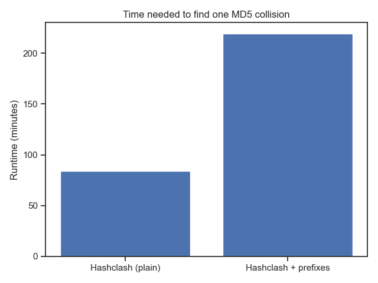
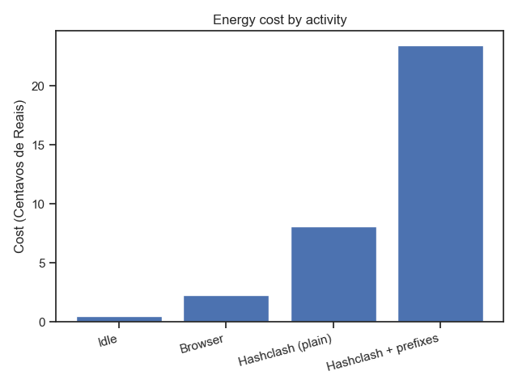
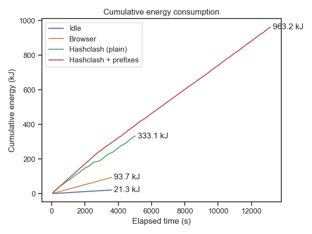

# Quebrando o MD5 com HashClash
> Uma demonstração prática de colisão de **prefixo escolhido** capaz de gerar dois arquivos com o **mesmo MD5** a um custo estimado de **R$ 0,24**

---

## 1 · Objetivos

* Demonstrar, na prática, como o algoritmo **HashClash** explora vulnerabilidades do MD5 para produzir colisões de prefixo escolhido.  
* Medir custo computacional e documentar todo o pipeline de geração das colisões.  
* Produzir artefatos (código, logs, gráficos) que permitam a qualquer pessoa **reproduzir** os experimentos.

---

## 2 · Fundamentação rápida

| Conceito | Resumo |
|----------|--------|
| **MD5** | Função hash de 128 bits criada em 1991; fraquezas teóricas apareceram em 1996 e colisões práticas em 2004 |
| **Colisão clássica** | Busca dois arquivos quaisquer com mesmo hash, mas sem controle sobre o conteúdo |
| **Colisão de prefixo escolhido** | Permite escolher dois prefixos significativos (ex.: contrato legítimo × contrato fraudulento) e anexar blocos calculados para igualar o MD5 final |
| **HashClash** | Ferramenta de Marc Stevens que automatiza o ataque em **duas fases**: *Birthday Search* + *Caminhos Diferenciais* |

---

## 3 · Metodologia

1. **Arquivos de entrada**  
   * `p1.bin` – contém apenas “Arquivo 1”  
   * `p2.bin` – contém “Arquivo 2, diferente do arquivo 1”  

2. **Fase 1 — Birthday Search**  
   Gera milhões de variações de bloco até encontrar um par cujo estado interno difira na forma “favorável” exigida pelos caminhos diferenciais.  

3. **Fase 2 — Caminhos Diferenciais**  
   Constrói blocos de quase-colisão que vão “zerando” essa diferença ao longo das 64 rodadas da função de compressão.  

4. **Ambiente**  
   * 8 CPUs @ 3.4 GHz, 32 GB RAM 
   * Custo de energia ≈ **R$ 0,24** para finalizar a colisão.

---

## 4 · Como reproduzir

> 🛑 **Passo extra obrigatório:** o código assume a presença do repositório original do HashClash.  
> Clone-o lado a lado **antes** de rodar qualquer script:

```bash
git clone https://github.com/seu-usuario/este-repo.git
git clone https://github.com/cr-marcstevens/hashclash.git   # necessário!
cd este-repo
./setup.sh         # instala dependências e compila helpers
./run.sh           # dispara todo o pipeline (≈ 20 min na infra descrita)
```

Para verificar os resultados, entre na pasta `results/ID_DE_EXECUÇÃO` e use o comando `md5sum` para comparar o MD5 digest das colisões encontradas pelo HashClash.

---

## 5 · Gráfico Gerados

Foram gerados 4 perfis de ambiente para fins de medição:
1. Idle - Computador ligado, mas com nenhum programa extra rodando;
2. Browser - Ambos Mozila Firefox e Google Chrome ficaram ligados com vídeos do YouTube;
3. Hashclash (plain) - Apenas o HashClash estava ligado, procurando uma colisão clássica;
4. Hashclash + prefixes - Apenas o HashClash estava ligado, procurando uma colisão de prefixo escolhido;

### Distribução do tempo de execução



### Média de energia usada por atividade



### Perfil de gasto de energia pelo HashClash + prefixes

Esse gráfico serve bem para demonstrar como a parte inicial (_birthday search_) é o gargalo computacional de tempo e energia.


### Gasto cumulativo de energia por atividade



### Média de custo por atividade em centavos


